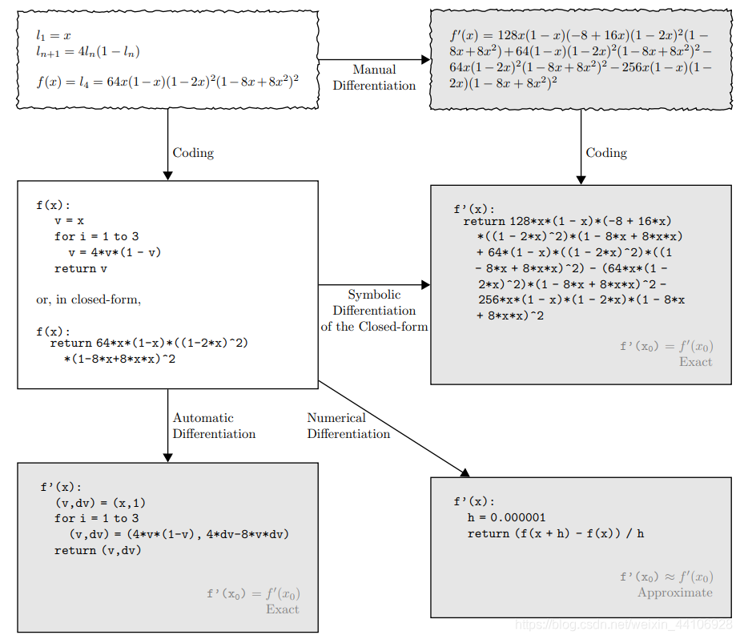

# 1.3 反向求导

## 1.3.1 数值微分、符号微分、自动微分

在深度学习中，我们通常会对模型进行反向求导。想要用计算机进行求导运算，主要有三种方法

### 数值微分

数值微分是基于导数的定义的一种求导方法，利用差商替代微商。比较简单，但是会出现截断误差，其公式如下。

$$\lim\limits_{h \to 0} \frac{f(x+h)-f(x)}{h}$$

Python实现过程如下（基于numpy）
```Python
# from CS231n
import numpy as np
def numerical_gradient(f, x):
    h = 1e-4  # 0.0001
    grad = np.zeros_like(x)

    it = np.nditer(x, flags=['multi_index'], op_flags=['readwrite'])
    while not it.finished:
        #f(x+h)-f(x-h)/2h
        idx = it.multi_index
        tmp_val = x[idx]
        x[idx] = float(tmp_val) + h
        fxh1 = f(x)

        x[idx] = tmp_val - h
        fxh2 = f(x)
        grad[idx] = (fxh1 - fxh2) / (2 * h)

        x[idx] = tmp_val
        it.iternext()

    return grad
```
以上程序的缺点也是很明显，如果x的大小是10000，那运算也要做10000次，费时费力。

### 符号微分

符号微分虽解决了数值微分截断误差、速度慢等问题。但函数如果很复杂，那又会出现表达式膨胀问题。


### 自动微分

自动微分结合了数值微分和符号微分，解决了数值微分和符号微分出现的问题，简单易用效率高。

自动微分有两种模式，分别是前向模式和后向模式。前向模式是指在计算时进行求导运算，计算完了，导数也计算出来了。后向模式是指在计算后进行求导运算。后向模式中间变量比前向模式少，因而后向模式效率高。现在的深度学习框架普遍采用后向模式。

mrdflow采用了后向求导模式，效率更高。

## 1.3.2 Tensor数组的求导
想要对Tensor数组进行求导，需要在创建时将grad参数设置成True（默认是False）
```Python
import mrdflow.autograd as ag
x = ag.arange(12,grad=True)
c = ag.sin(x/2)
c.gradient()
print(x.grad)
#打印关于c对x的导数
x.clear_grad()
#清空导数
```